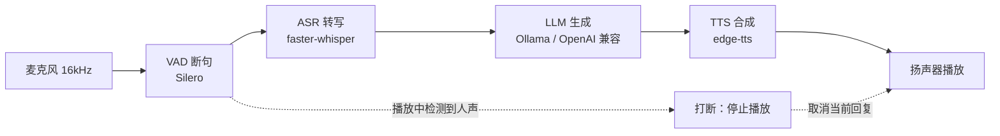

# Echo — 本地实时语音对话助手

一条**完全本地可运行**的实时语音对话链路：麦克风采集 → VAD 断句 → 本地 ASR 转写 → LLM 生成回复 → TTS 合成 → 扬声器播放，并支持**说话打断**（回复说到一半，用户开口即停止播放）。

项目面向"可演示、可追问"的工程实践：四个组件全部按"抽象接口 + 注册表工厂 + 配置驱动 + 依赖注入"组织，换后端只改配置、不动调用方。

---

## 架构



四个组件通过 `ServiceContext` 注入到 `ConversationPipeline`：

```
ServiceContext(config)
  ├── vad_engine    ← create_vad(vad_type, **params)
  ├── asr_engine    ← create_asr(asr_type, **params)
  ├── llm_engine    ← create_llm(llm_type, **params)
  └── tts_engine    ← create_tts(tts_type, **params)
```

加一个新后端 = 新增一个文件 + `@register_xxx("名字")`，工厂与业务代码一行不改。

---

## 快速开始

```bash
python -m venv .venv
.venv\Scripts\activate          # Windows；macOS/Linux 用 source .venv/bin/activate
pip install -r requirements.txt
```

按需要准备模型与模型服务：

- **ASR**：faster-whisper 首次运行会自动下载模型（默认 `small`，缓存在 `models/whisper`）
- **LLM**：安装 [Ollama](https://ollama.com) 后执行 `ollama pull qwen2.5:3b`，并把 `conf.yaml` 的 `llm_type` 改成 `"ollama"`；或用任意 OpenAI 兼容 API（`llm_type: "openai_compatible"` + 环境变量 `ECHO_LLM_API_KEY`）
- **TTS**：edge-tts 需要联网

运行：

```bash
python main.py --mode check                          # 检查四个组件是否创建成功
python main.py --mode text                           # 文本对话（不占麦克风，建议先跑这个）
python main.py --mode console                        # 语音对话（建议戴耳机，避免回声误触发打断）
python main.py --mode tts --text "你好，我是 Echo"    # 只测语音合成
python main.py --mode asr --wav 你的录音.wav          # 只测语音识别（任意常见格式）
```

---

## 配置驱动

所有选型都在 `conf.yaml`，改一行切换实现：

| 组件 | 可选后端 | 说明 |
|------|---------|------|
| VAD | `silero_vad` / `mock_vad` / `none` | 双阈值 + 三态状态机 + 预缓冲防切头 |
| ASR | `faster_whisper` / `sherpa_onnx` / `mock_asr` / `none` | 本地离线识别 |
| LLM | `ollama` / `openai_compatible` / `mock_llm` / `none` | 本地或云端大模型 |
| TTS | `edge_tts` / `mock_tts` / `none` | 在线合成，可换中文男女声 |

每个组件都有 `mock` 假实现：**没有模型、没有网络、没有声卡也能跑通全链路**，这是自动化测试能覆盖整条管线的前提。

---

## 实测数据

环境：Windows / Python 3.14 / CPU（int8）/ faster-whisper small

| 指标 | 数值 | 来源 |
|------|------|------|
| 5 秒音频转写（CPU） | 约 1.5 s | `benchmarks/results.md` |
| 模型首次加载 | 约 1.9 s | 同上 |
| edge-tts 合成一句话 | 约 1–2 s（含网络） | 实测 |

测试：**36 个用例全部通过**（含 VAD/ASR 回归、LLM/TTS 工厂、记忆、管线端到端与降级防回归），
运行方式：`python -m pytest tests -q`，全程使用 mock 后端，不需要模型和声卡。

---

## 工程化设计要点

- **接口解耦**：四个组件各有抽象接口，调用方只依赖接口
- **工厂可扩展**：注册表 + 装饰器，新增后端不改工厂代码
- **配置驱动**：Pydantic 校验配置（如非法 `provider`/`compute_type` 直接拦下）
- **依赖注入**：组件统一由 `ServiceContext` 创建并注入管线
- **异步设计**：CPU 密集推理（VAD/ASR）用 `asyncio.to_thread` 包装，不阻塞事件循环
- **错误降级**：GPU/CUDA 库缺失时自动回退 CPU（见 `docs/真实Bug笔记.md` 的 Bug #1）
- **可测试性**：mock 后端 + 可注入的麦克风与播放器，让管线测试完全不碰硬件

---

## 目录结构

```
echo-voice-assistant/
├── main.py                 # CLI 入口（check / text / console / tts / asr）
├── conf.yaml               # 全部配置：VAD/ASR/LLM/TTS + 应用参数
├── requirements.txt
├── src/echo/
│   ├── config.py           # Pydantic 配置模型
│   ├── service_context.py  # 依赖注入容器
│   ├── vad/                # VAD 接口 / Silero / 状态机 / 工厂
│   ├── asr/                # ASR 接口 / faster-whisper / sherpa-onnx / 工厂
│   ├── llm/                # LLM 接口 / Ollama / OpenAI 兼容 / 工厂
│   ├── tts/                # TTS 接口 / edge-tts / 工厂
│   ├── audio/              # 麦克风采集与播放
│   ├── memory/             # 多轮对话历史（JSON 持久化）
│   └── pipeline/           # 对话管线（含打断）
├── tests/                  # 36 个测试，全部 mock 化
├── benchmarks/             # 延迟基线记录
└── docs/                   # 真实 Bug 笔记、理解补课清单
```


---

## 已知限制与 Roadmap

- **Live2D 形象未接入**：当前版本聚焦语音链路，角色渲染在路线图中
- **打断依赖耳机**：扬声器外放时回声可能触发自我打断，真实产品需要 AEC（回声消除）
- **LLM 需外部服务**：本地默认走 Ollama；未安装时可用 mock 跑通链路
- **SenseVoice 后端待实测**：`sherpa_onnx` 脚手架已就位，模型与依赖尚未接入

---

## 开发说明

本项目在架构设计、Bug 排查与文档上与 AI 助手协作完成；
AI 参与的范围与对应的理解补课清单记录在 `docs/理解补课清单.md`，
确保每一个"能跑"的模块都能被解释清楚。
