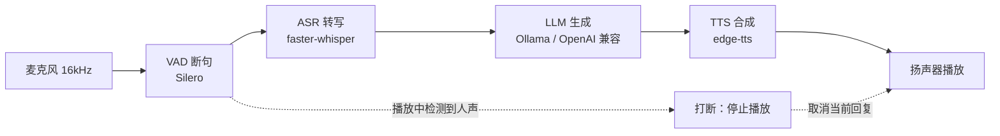

# Echo — Agent 驱动的 Live2D AI 伴侣

一个**本地优先的桌面 AI 伴侣**：Agent 是大脑（会调用工具、有记忆、输出情绪），
Live2D 是身体（表情与口型随之变化），语音是它的耳朵和嘴。架构思路参考 Open-LLM-VTuber 与 Pipecat。

- **M1 感官层（已完成）**：麦克风 → VAD 断句 → 本地 ASR → LLM → TTS → 播放，支持打断/双工模式
- **M2 Agent 大脑（已完成）**：function calling 工具调用（时间/天气/记忆）、长期记忆、结构化输出 `{reply, emotion}`
- **M3 Live2D 身体（下一步）**：角色渲染 + 口型同步 + 情绪驱动的表情切换

实际效果（真实调用 DeepSeek）：

```
用户：现在几点了？顺便帮我查一下北京的天气
  [tool_call] get_current_time
  [tool_call] get_weather        ← 真去查了 Open-Meteo
  [speech] 现在是晚上9点13分啦～北京这会儿25.6℃，风不大，挺舒服的，晚上出门遛弯正合适！
  [emotion] happy                ← 这个字段下一步驱动 Live2D 表情
```

四个核心组件全部按"抽象接口 + 注册表工厂 + 配置驱动 + 依赖注入"组织，换后端只改配置、不动调用方。

## 文档

| 文档 | 内容 |
|------|------|
| [调用链](docs/调用链.md) | 从启动到说话的完整调用链（含时序图与面试速答版） |
| [需求文档](docs/需求文档.md) | 背景、范围、用户故事、功能/非功能需求、验收与里程碑 |
| [架构设计](docs/架构设计.md) | 分层架构、时序图、并发模型、扩展指南、错误降级、测试策略 |
| [接口文档](docs/接口文档.md) | 组件接口契约、工厂 API、管线事件、CLI、全量配置项参考 |
| [编码 Agent 集成设计](docs/编码Agent集成设计.md) | 两套工具包（陪伴/编码）、沙箱与权限、评测设计与分阶段计划 |
| [架构对齐方案](docs/架构对齐方案.md) | 契约/呈现/运行时/传输四层对齐、增量迁移阶段与模块对照 |
| [真实 Bug 笔记](docs/真实Bug笔记.md) | 实际踩坑的排查过程（CUDA 缺库 → 运行期降级） |
| [理解补课清单](docs/理解补课清单.md) | 各模块面试前必须能回答的问题 |
| [延迟基线](benchmarks/results.md) | 实测性能数据与测量方式 |
| [项目开发规范](AGENTS.md) | 架构不变量、编码/测试/文档要求、安全红线 |

## 项目定位与里程碑

| 里程碑 | 内容 | 状态 |
|--------|------|------|
| **M1 感官层** | VAD / ASR / LLM / TTS 四件套 + 并发管线 + 双工模式 + 配置驱动 | ✅ 已完成 |
| **M2 Agent 大脑** | 工具调用循环、长期记忆、情绪结构化输出、工具调用轨迹 | ✅ 已完成 |
| **M3 Live2D 身体** | Web 端角色渲染、口型同步、情绪驱动表情、事件总线 | ⏳ 下一步 |
| **M4 实时性与体验** | 分句流式 TTS/LLM、AEC 真全双工、统一指标（TTFB/TTFA） | ⏳ 规划 |
| **M5 编码 Agent 能力** | 仓库检索与上下文预算、编辑/执行工具、沙箱与回滚、评测 harness | 🆕 设计已就绪 |

---

## 架构



四个组件通过 `ServiceContext` 注入到 `ConversationPipeline`：

```
ServiceContext(config)
  ├── vad_engine    ← create_vad(vad_type, **params)
  ├── asr_engine    ← create_asr(asr_type, **params)
  ├── llm_engine    ← create_llm(llm_type, **params)
  └── tts_engine    ← create_tts(tts_type, **params)
```

加一个新后端 = 新增一个文件 + `@register_xxx("名字")`，工厂与业务代码一行不改。

---

## 快速开始

```bash
python -m venv .venv
.venv\Scripts\activate          # Windows；macOS/Linux 用 source .venv/bin/activate
pip install -r requirements.txt
```

按需要准备模型与模型服务：

- **ASR**：faster-whisper 首次运行会自动下载模型（默认 `small`，缓存在 `models/whisper`）
- **LLM**：默认走 OpenAI 兼容 API——把 `.env.example` 复制成 `.env` 并填入 `ECHO_LLM_API_KEY`，
  需要换服务商时改 `conf.yaml` 里 `base_url` / `model` 两行即可（文件内附 DeepSeek / 通义 / 智谱 / 月之暗面 / 硅基流动示例）。
  想完全本地运行则安装 [Ollama](https://ollama.com)、`ollama pull qwen2.5:3b`，再把 `llm_type` 改成 `"ollama"`。
- **TTS**：edge-tts 需要联网

运行：

```bash
.\run.bat --mode console                             # 一键启动（自动使用项目虚拟环境）
.\run.bat --mode llm --text "你好"                    # 只测大模型接口
python main.py --mode check                          # 检查四个组件是否创建成功
python main.py --mode llm --text "你好"               # 只测大模型接口（排查 API 配置最快）
python main.py --mode text                           # 文本对话（不占麦克风，建议先跑这个）
python main.py --mode console                        # 语音对话（建议戴耳机，避免回声误触发打断）
python main.py --mode tts --text "你好，我是 Echo"    # 只测语音合成
python main.py --mode asr --wav 你的录音.wav          # 只测语音识别（任意常见格式）
```

> 直接 `python main.py` 要求当前解释器装好依赖；推荐用 `run.bat` / `run.ps1`，
> 它会自动使用项目自带的 `.venv`，避免"用了系统 Python 导致 ModuleNotFoundError"。

---

## 配置驱动

所有选型都在 `conf.yaml`，改一行切换实现：

| 组件 | 可选后端 | 说明 |
|------|---------|------|
| VAD | `silero_vad` / `mock_vad` / `none` | 双阈值 + 三态状态机 + 预缓冲防切头 |
| ASR | `faster_whisper` / `sherpa_onnx` / `mock_asr` / `none` | 本地离线识别 |
| LLM | `ollama` / `openai_compatible` / `mock_llm` / `none` | 本地或云端大模型 |
| TTS | `edge_tts` / `mock_tts` / `none` | 在线合成，可换中文男女声 |

每个组件都有 `mock` 假实现：**没有模型、没有网络、没有声卡也能跑通全链路**，这是自动化测试能覆盖整条管线的前提。

---

## 实测数据

环境：Windows / Python 3.14 / CPU（int8）/ faster-whisper small

| 指标 | 数值 | 来源 |
|------|------|------|
| 5 秒音频转写（CPU） | 约 1.5 s | `benchmarks/results.md` |
| LLM 整句生成（DeepSeek API） | 0.6 ~ 0.9 s | 同上 |
| TTS 合成（约 25 字回复） | 约 2.7 s | 同上 |
| 模型首次加载 | 约 1.9 s | 同上 |

测量脚本：`python benchmarks/benchmark_once.py --text "..." --repeat 3`

测试：**52 个用例全部通过**（含 VAD/ASR 回归、LLM/TTS 工厂、`.env` 加载、API 请求构造与错误提示、记忆、
Agent 工具调用循环与情绪解析、并发管线与双工模式、超长/断流保护、降级防回归），
运行方式：`python -m pytest tests -q`，全程使用 mock 后端，不需要模型和声卡。

---

## 工程化设计要点

- **接口解耦**：四个组件各有抽象接口，调用方只依赖接口
- **工厂可扩展**：注册表 + 装饰器，新增后端不改工厂代码
- **配置驱动**：Pydantic 校验配置（如非法 `provider`/`compute_type` 直接拦下）
- **依赖注入**：组件统一由 `ServiceContext` 创建并注入管线
- **异步设计**：CPU 密集推理（VAD/ASR）用 `asyncio.to_thread` 包装，不阻塞事件循环
- **错误降级**：GPU/CUDA 库缺失时自动回退 CPU（见 `docs/真实Bug笔记.md` 的 Bug #1）
- **可测试性**：mock 后端 + 可注入的麦克风与播放器，让管线测试完全不碰硬件

---

## 目录结构

```
echo-voice-assistant/
├── main.py                 # CLI 入口（check / text / console / tts / asr）
├── conf.yaml               # 全部配置：VAD/ASR/LLM/TTS + 应用参数
├── requirements.txt
├── src/echo/
│   ├── config.py           # Pydantic 配置模型
│   ├── service_context.py  # 依赖注入容器
│   ├── vad/                # VAD 接口 / Silero / 状态机 / 工厂
│   ├── asr/                # ASR 接口 / faster-whisper / sherpa-onnx / 工厂
│   ├── llm/                # LLM 接口 / Ollama / OpenAI 兼容 / 工厂
│   ├── tts/                # TTS 接口 / edge-tts / 工厂
│   ├── audio/              # 麦克风采集与播放
│   ├── memory/             # 多轮对话历史（JSON 持久化）
│   └── pipeline/           # 对话管线（含打断）
├── tests/                  # 36 个测试，全部 mock 化
├── benchmarks/             # 延迟基线记录
└── docs/                   # 真实 Bug 笔记、理解补课清单
```

---

## 已知限制与 Roadmap

- **Live2D 形象未接入**：属于 M3 里程碑，Agent 事件流（thinking/tool_call/speech/emotion）已就绪，可直接对接
- **工具调用延迟偏高**：一次"查时间+查天气"约 6.9 秒（3 次模型往返），下一步做并行工具调用与流式输出
- **打断依赖耳机**：扬声器外放时回声可能触发自我打断，真实产品需要 AEC（回声消除）
- **LLM 需外部服务**：本地默认走 Ollama；未安装时可用 mock 跑通链路
- **SenseVoice 后端待实测**：`sherpa_onnx` 脚手架已就位，模型与依赖尚未接入

---

## 开发说明

本项目在架构设计、Bug 排查与文档上与 AI 助手协作完成；
AI 参与的范围与对应的理解补课清单记录在 `docs/理解补课清单.md`，
确保每一个"能跑"的模块都能被解释清楚。
