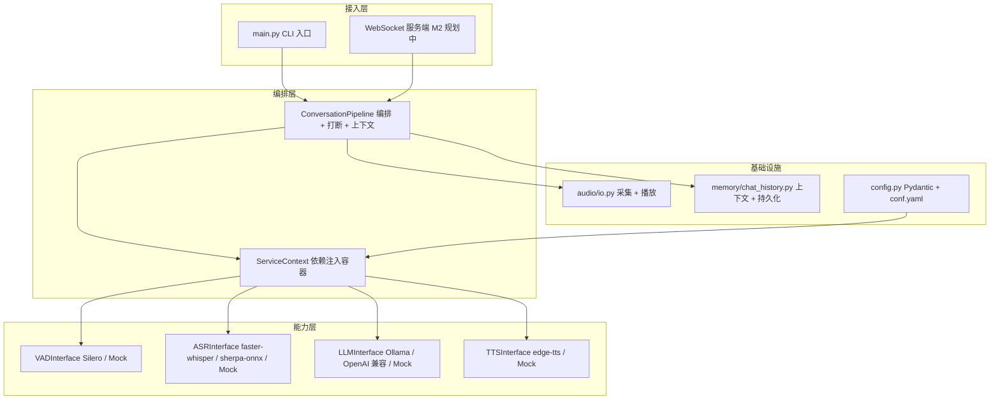
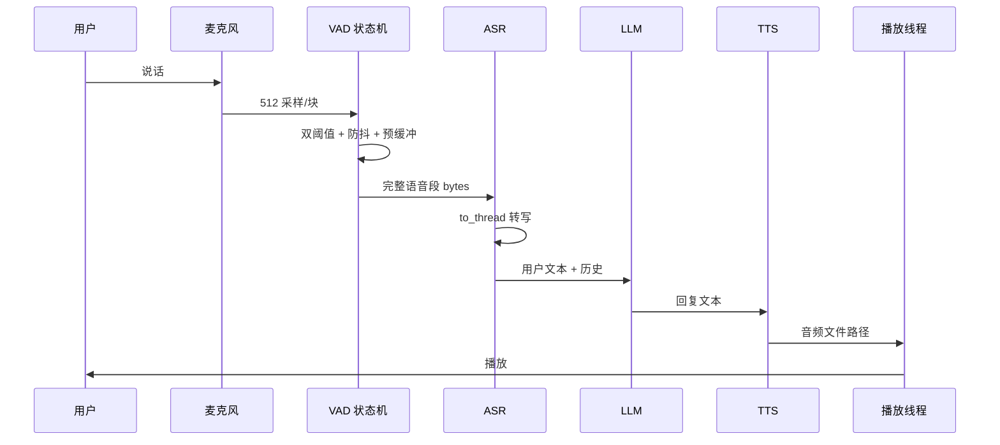
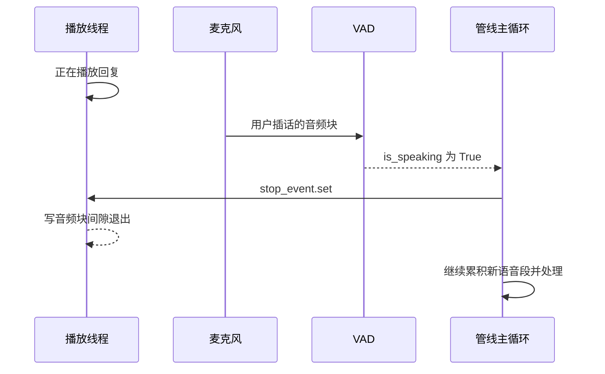
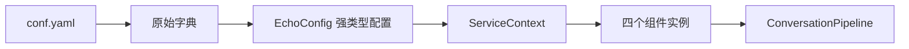

# Echo 架构设计

> 版本：v0.1 ｜ 更新日期：2026-09-11 ｜ 对应代码：`src/echo/`

---

## 1. 架构总览

**分层原则**：上层只依赖下层接口；能力层四个组件互不依赖；基础设施不含业务判断。

---

## 2. 模块职责

| 模块 | 职责 | 不负责 |
|------|------|--------|
| `config.py` | 定义并校验全部配置（Pydantic） | 不创建任何组件 |
| `service_context.py` | 按配置创建并持有四个组件 | 不做业务编排 |
| `vad/` | 流式断句、说话状态、预缓冲 | 不做转写 |
| `asr/` | 音频 → 文本，含结果清洗 | 不管理对话 |
| `llm/` | 消息列表 → 回复文本 | 不管历史存储 |
| `tts/` | 文本 → 音频文件 | 不管播放设备 |
| `audio/io.py` | 麦克风采集、音频解码、可打断播放 | 不做 VAD 判断 |
| `memory/` | 多轮上下文、JSON 持久化 | 不做摘要/检索（M3） |
| `pipeline/` | 串链路、事件回调、打断、上下文组装 | 不直接碰模型 API |

---

## 3. 关键设计决策

| 决策 | 理由 | 代价 |
|------|------|------|
| 四组件统一"接口 + 注册表工厂 + 配置 + DI" | 换后端零改动；可 mock；可并行演进 | 多一层间接，初学成本高 |
| 全链路统一 16kHz / 单声道 / float32 | 语音模型都在 16k 上训练；接口常量优于层层传参 | 需要重采样；采样率错误不易察觉 |
| 每个组件都提供 mock 实现 | 测试不依赖模型/网络/声卡，CI 可跑 | mock 验证不了识别效果，需真实冒烟测试补偿 |
| 阻塞推理放线程池（`asyncio.to_thread`） | 不阻塞事件循环，音频回调不被拖死 | 线程池任务无法真正取消 |
| 打断用 `threading.Event` 而非取消协程 | 播放是阻塞 IO；取消 `await` 不会停止底层写入 | 需自行管理线程生命周期 |
| 历史用"按条数裁剪 + JSON" | 简单、可解释、可恢复 | 不是长期记忆（M3 用摘要/检索替代） |
| 设备降级放在运行期而非初始化 | CUDA 缺库报错发生在首次推理 | 首次请求多一次失败重试 |

---

## 4. 运行时数据流

### 4.1 正常一轮对话

### 4.2 打断时序

---

## 5. 并发模型

| 执行体 | 承载任务 | 说明 |
|--------|---------|------|
| 事件循环 | 管线编排、LLM/TTS 网络等待 | 不执行 CPU 密集计算 |
| 线程池（`to_thread`） | ASR 转写、阻塞式 IO | 默认线程数约等于 CPU 核数；任务不可取消 |
| 麦克风回调线程 | 采集音频 → 队列 | 队列满时丢弃旧块，保证低延迟 |
| 播放线程 | 写音频到声卡 | 每块检查 `stop_event`，支持打断 |

**边界原则**：事件循环内只做等待与编排，任何超过几毫秒的同步调用都下沉到线程池。
这也是"打断不能靠 `cancel()`"的根因——取消的只是等待，而不是线程里的推理。

---

## 6. 配置与依赖注入流程

- 配置非法在启动阶段即报错（例如 `provider="rocm"`、`compute_type="float8"` 直接拦下）
- `xxx_type: "none"` 表示显式禁用该组件，对应引擎保持 `None`

---

## 7. 扩展指南：新增一个后端

以"新增通义千问 API 后端"为例：

1. 新建 `src/echo/llm/qwen_llm.py`，实现 `LLMInterface.chat()`
2. 加装饰器 `@register_llm("qwen")`
3. 在 `llm_factory.py` 的 `_BACKEND_MODULES` 登记模块与依赖（用于延迟导入提示）
4. `conf.yaml` 增加配置段，并把 `llm_type` 改成 `"qwen"`

现有工厂、容器、管线代码零改动——这是架构解耦的验收方式。

---

## 8. 错误处理与降级

| 场景 | 行为 |
|------|------|
| 第三方包未安装 | 延迟导入抛 `ImportError`，附安装命令；mock 链路不受影响 |
| 模型文件缺失 | `FileNotFoundError` + 下载指引，不进入推理 |
| GPU 不可用 / CUDA 库缺失 | 捕获设备类异常 → CPU + int8 重建模型重试 → 打印降级日志 |
| 音频播放失败 | 触发 `error` 事件，管线继续监听，不终止会话 |
| 历史文件损坏 | 视为空历史，程序正常启动 |
| 语音段过短 | 丢弃（低于 `min_utterance_seconds`） |

详见 `docs/真实Bug笔记.md` 的 Bug #1。

---

## 9. 性能设计与优化路线

当前实测（详见 `benchmarks/results.md`）：ASR 5 秒音频约 1.5s（CPU int8）、TTS 约 1–2s（含网络）。

瓶颈与优化顺序：

1. **LLM 非流式** → 改流式，按句切分提前触发 TTS（首字延迟）
2. **TTS 整句合成** → 分句合成，边合成边播放
3. **VAD 收尾等待** → 动态调整 `required_misses`，静音阈值自适应
4. **模型选型** → CPU/GPU、量化档位对比，形成选型表

---

## 10. 测试策略

| 层次 | 覆盖内容 | 依赖真实模型 |
|------|---------|-------------|
| 契约测试 | 接口不可实例化、方法语义、类型约定 | 否 |
| 单元测试 | 配置校验、工厂注册与拒绝、标签清洗、历史裁剪 | 否 |
| 集成测试 | 管线端到端（假麦克风 + 假播放器 + mock 组件） | 否 |
| 防回归测试 | 设备降级、超短语音丢弃、打断停止播放 | 否 |
| 冒烟测试 | 真实模型转写、真实 TTS 出声（手工执行并记录数字） | 是 |

---

## 11. 风险与技术债

| 项 | 影响 | 计划 |
|----|------|------|
| 无 AEC | 外放时可能自打断 | M2 评估 WebRTC AEC 或半双工 |
| 非流式链路 | 首字延迟高 | M2 |
| 线程池不可取消 | 打断后计算资源仍被占用 | 记录为已知限制 |
| SenseVoice 未实测 | 少一条中文优化路径 | 视时间补齐 |
| 无监控与压测 | 无法量化回归 | 每次改动补 `benchmarks` 记录 |
