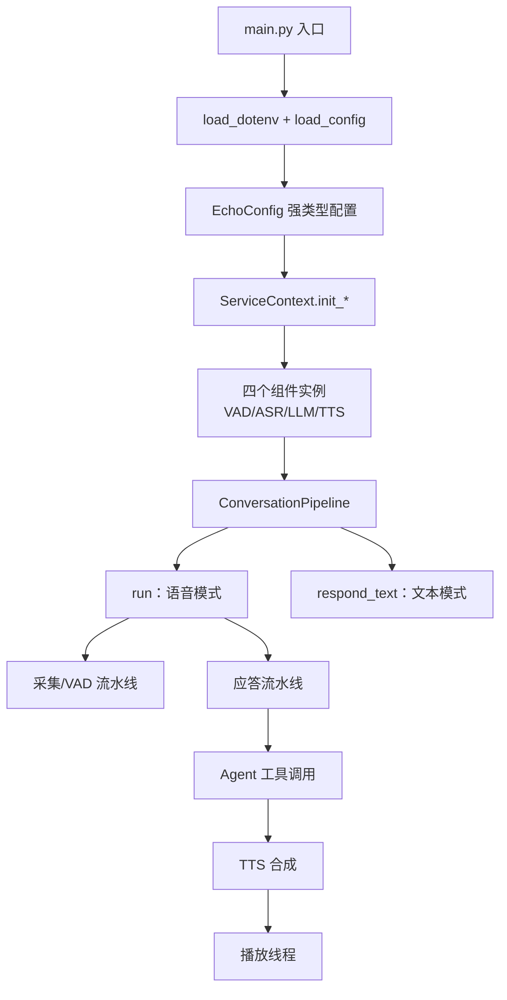
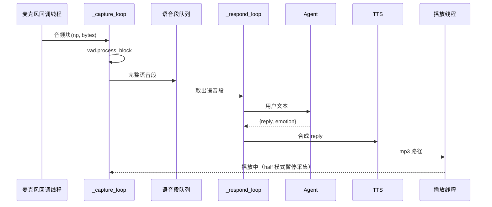

# Echo 调用链（从启动到说话）

> 对应代码：`main.py`、`src/echo/` ｜ 更新日期：2026-09-13
>
> 面试用法：先把"启动链"和"语音链"两条主线讲清楚，再按需展开工具调用与打断。

---

## 0. 全局视图



---

## 1. 启动链（所有模式共用）

| 顺序 | 调用 | 文件 | 说明 |
|------|------|------|------|
| 1 | `main()` | `main.py` | 解析 `--mode` 等参数 |
| 2 | `os.chdir(ROOT)` + `load_dotenv(ROOT/.env)` | `main.py`、`echo/env_loader.py` | 统一工作目录；读取 API Key（环境变量优先） |
| 3 | `load_config()` → `EchoConfig.model_validate(yaml...)` | `main.py`、`echo/config.py` | YAML → Pydantic 强类型配置，非法值当场报错 |
| 4 | `build_context(config, components)` | `main.py` | 按模式只初始化需要的组件 |
| 5 | `ServiceContext.init_llm()` 等 | `echo/service_context.py` | 调 `create_llm(llm_type, **params)` |
| 6 | `create_xxx()` → 注册表查表 → 实例化 | `echo/*/*_factory.py` | 真实后端延迟导入；缺依赖给安装提示 |
| 7 | 构造 `ConversationPipeline(ctx, ...)` | `echo/pipeline/conversation.py` | 注入四个组件；若 `agent_config.enabled` 同时构造 `Agent` |

要点：**配置 → 容器 → 工厂 → 实例**这条链是单向的，组件之间互不 new。

---

## 2. 语音对话链（`--mode console`）

### 2.1 两阶段启动

```
mode_console()                       # main.py
  └─ ConversationPipeline.run()      # pipeline/conversation.py
       ├─ mic.start()                # 打开麦克风流（回调线程开始灌队列）
       ├─ asyncio.gather(
       │      _capture_loop(),       # 流水线 A：只听
       │      _respond_loop()        # 流水线 B：只想与说
       │  )
       └─ finally: interrupt() / mic.stop() / 打印丢块统计
```

### 2.2 流水线 A：采集与切句（永不阻塞）

```
_capture_loop()
  ├─ [half 模式] 若正在播放 → mic.stop()，播完 mic.start()
  ├─ mic.get(0.5)                   # 内部 = 麦克风回调线程写入的队列
  ├─ vad.process_block(audio_np, bytes)   # SileroVADEngine
  │     └─ state_machine.process(prob, db, bytes)  # 三态 + 双阈值 + 底噪自适应
  │            └─ 说完了 → 返回整段 bytes
  ├─ [barge_in 模式] 播放中检测到人声 → interrupt()
  ├─ _enforce_max_utterance()       # 单句超长 → force_flush()
  ├─ _handle_mic_idle()             # 断流 → 先抢救语音段，再重启采集
  └─ segment → _push_segment() → asyncio.Queue(maxsize=4)
```

### 2.3 流水线 B：应答

```
_respond_loop()
  └─ queue.get() → handle_segment(segment_bytes)
       ├─ np.frombuffer → 时长过滤（min_utterance_seconds）
       ├─ asr.async_transcribe_np(audio)      # to_thread 包住 faster-whisper
       └─ respond_text(text)
            ├─ agent.respond(text)            # 见第 3 节
            ├─ tts.async_synthesize(reply)    # edge-tts → mp3 文件
            └─ _start_playback(path)
                 └─ 播放线程 player(path, stop_event) → play_file → sounddevice
```

### 2.4 时序图



---

## 3. 单轮应答链：Agent 的工具调用

```
Agent.respond(user_text)                       # agent/agent.py
  ├─ build_messages()                          # system(人设+工具+输出格式) + 历史 + 长期记忆 + 本轮输入
  ├─ llm.async_chat_with_tools(messages, tools.specs())
  │     └─ OpenAICompatibleLLM.chat_with_tools → POST /chat/completions (tools=...)
  ├─ 若返回 tool_calls：
  │     ├─ _emit("tool_call", ...)
  │     ├─ ToolRegistry.call(name, arguments)  # 执行 get_current_time / get_weather / remember / recall
  │     ├─ _emit("tool_result", ...)
  │     ├─ messages += assistant(tool_calls) + tool(result)
  │     └─ 回到上一步再问模型（最多 max_iterations 轮）
  └─ 若返回最终文本：
        ├─ parse_agent_output() → (reply, emotion)
        ├─ _emit("speech") / _emit("emotion")
        └─ 写入 ChatHistory → 返回 AgentReply
```

**实测**：一次"查时间 + 查天气"的请求 = 3 次模型往返（首轮决定调工具 → 工具结果回填 → 最终回答），
总耗时约 6.9 秒，其中工具本身只占几百毫秒，**瓶颈是模型往返次数**。

---

## 4. 打断与双工链

| 模式 | 采集行为 | 打断 | 代码路径 |
|------|---------|------|---------|
| `half`（默认） | 播放时 `mic.stop()`，播完 `mic.start()` | 不支持 | `_capture_loop` 里的双工分支 |
| `barge_in` | 播放期间继续采集 | 用户开口即 `interrupt()` | `_capture_loop` → `interrupt()` → `stop_event.set()` → 播放线程退出 |
| `full` | 全程采集 | 不支持（等 AEC） | 同上分支 |

`interrupt()` 只做一件事：`stop_event.set()` + `join` 播放线程；
**它不会取消已经发出的 LLM/TTS 请求**（已知缺陷，见 `docs/与Pipecat对照评审.md`）。

---

## 5. 事件流（M3 Live2D 的对接点）

| 事件 | 发射位置 | 载荷 | 前端用途 |
|------|---------|------|---------|
| `listening` | `pipeline.run()` | — | 角色进入聆听状态 |
| `thinking` | `agent.respond()` | `{"step"}` | 思考动画 |
| `tool_call` / `tool_result` | `agent.respond()` | `{"name","arguments"/"result"}` | 显示"正在查天气" |
| `asr` | `handle_segment()` | `{"text","ms"}` | 用户气泡 |
| `llm` | `respond_text()` | `{"text","ms","emotion","tools"}` | 助手气泡 + 延迟 |
| `speech` | `agent.respond()` | `{"text"}` | 气泡文字 |
| `emotion` | `agent.respond()` | `{"emotion"}` | **驱动 Live2D 表情** |
| `tts` | `respond_text()` | `{"path","ms"}` | 播放音频 + 口型 |
| `interrupt` | `interrupt()` | — | 角色停止说话 |
| `error` | 多处 | 字符串 | 错误提示 |

---

## 6. 各 CLI 模式对应的调用链

| 模式 | 链路 | 是否用麦克风 | 初始化组件 |
|------|------|------------|-----------|
| `check` | 配置 → 容器 → 四个组件 | 否 | 全部 |
| `llm` | 配置 → 容器 → LLM → 单次对话 | 否 | LLM |
| `agent` | 配置 → 容器 → LLM → Agent（工具循环） | 否 | LLM |
| `text` | Agent → TTS → 播放 | 否 | LLM + TTS |
| `tts` | 文本 → edge-tts → 播放 | 否 | TTS |
| `asr` | 音频文件 → faster-whisper | 否 | ASR |
| `mic` | 麦克风 → 实时 dB/概率诊断 | 是 | VAD |
| `record` | 麦克风 → 写 WAV | 是 | 无 |
| `console` | 完整双流水线（第 2 节） | 是 | 全部 |

---

## 7. 执行体分布（谁在哪个"线程"上跑）

| 执行体 | 跑什么 | 备注 |
|--------|--------|------|
| 主线程事件循环 | `_capture_loop`、`_respond_loop`、Agent、HTTP 等待 | 只做编排与 IO 等待 |
| 线程池（`asyncio.to_thread`） | `mic.get()`、`asr.async_transcribe_np()` | 默认线程数约等于 CPU 核数 |
| 麦克风回调线程 | 采集 → 队列（队列满丢最旧并计数） | PortAudio 回调 |
| 播放线程 | `play_file(path, stop_event)` | 每块检查 `stop_event` |

---

## 8. 30 秒面试版

> 入口是 `main.py`：先读 `.env` 和 `conf.yaml`，用 Pydantic 校验成强类型配置，
> 然后 `ServiceContext` 通过工厂按配置创建 VAD/ASR/LLM/TTS 四个组件，注入 `ConversationPipeline`。
> 语音模式下管线跑两条并发流水线：一条只管采集和 VAD 切句，把语音段丢进队列；
> 另一条从队列取段，做 ASR、交给 Agent（Agent 里可能循环调用工具）、再 TTS 合成、交给播放线程。
> 播放期间按 `duplex_mode` 决定暂停采集还是允许插话，打断靠 `threading.Event` 通知播放线程退出。
> Agent 的每一步都会发事件（thinking / tool_call / speech / emotion），
> 这套事件流就是 Live2D 前端驱动表情和口型的接口。
